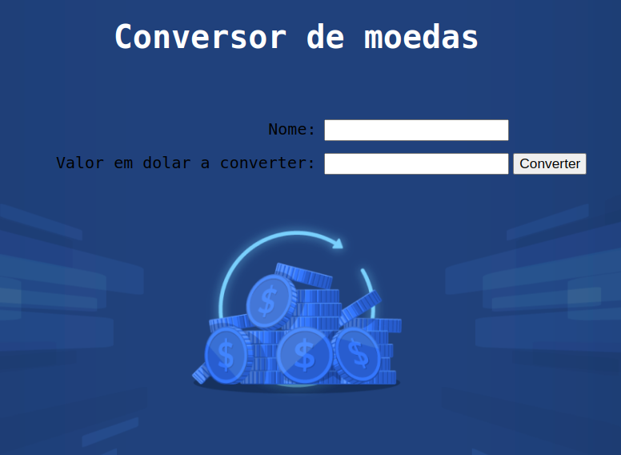
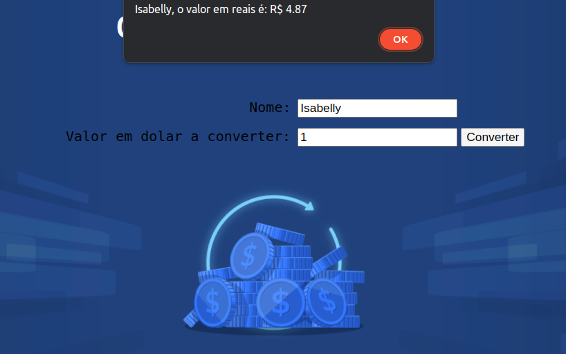

<h1 align="center"> Conversor de moedas </h1>

O conversor de moedas é site onde você pode converter  valor de moeda em Dolar para Real.  

 Para acessar o projeto clique no link a seguir: https://isabellyaquino.github.io/ConversorDeMoedas/ 

  <a href="#-projeto">Projeto</a>&nbsp;&nbsp;&nbsp;|&nbsp;&nbsp;&nbsp;
  <a href="#-tecnologias">Tecnologias</a>&nbsp;&nbsp;&nbsp;|&nbsp;&nbsp;&nbsp;
  <a href="#memo-licença">Licença</a>

  

 

  

  

## 💻 Projeto

O principal objetivo deste projeto é fornecer uma solução básica para a conversão de moeda em Dolar para Real. É uma ferramenta que permite aos usuários:

- Inserir informações como seu nome.
- Inserir o valor desejado para conversão.
- E em tela após cliclar no botão de conversõa recebe um aviso, contendo seu nome inserido e o valor em Dolar convertido para Real.

## 🚀 Tecnologias

Esse projeto foi desenvolvido com as seguintes tecnologias:

- Frontend: HTML e CSS
- Desenvolvimento: JavaScript
- Git e Github
- IDE: VScode

##  Licença

Esse projeto está sob a licença MIT.

---

